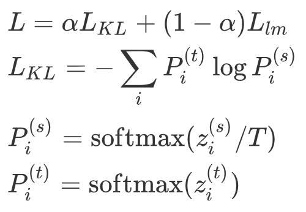

# CPM-Distill

本项目提供了 2.6B（26亿）参数 CPM-Large 模型的蒸馏代码，主要基于 Deepspeed、Megatron 实现。最终蒸馏的小参数模型参数量为 109M。蒸馏模型下载链接：https://cpm.baai.ac.cn/download.html

## 1 安装

1. 首先安装pytorch等基础依赖，再安装APEX以支持fp16。

   ```bash
   pip install torch
   git clone https://github.com/NVIDIA/apex
   cd apex
   pip install -v --no-cache-dir --global-option="--cpp_ext" --global-option="--cuda_ext" ./
   ```

   考虑apex的安装容易发生问题，我们构建了对应的Docker容器，可以进行快速环境搭建。安装方式如下：

   ```bash
   docker pull dmye/cpm:v0
   ```

   参考运行指令如下：

   ```bash
   sudo docker run --gpus '"device=0,1"' -it -v <path>:/CPM  --name=cpm  cpm:v0
   ```

2. 安装DeepSpeed，这部分更多细节请参照[DeepSpeed](https://github.com/microsoft/DeepSpeed#installation)项目安装说明。

   ```bash
   pip install deepspeed
   ```

   

## 2 数据生成

`scripts/gen_data.sh`中给出了生成数据文件的脚本示例。该脚本将一个多行的纯文本文件（一个 document 一行）转化为二进制文件（会输出一个 .bin 和一个 .idx 文件），方便模型读取。


## 3 模型

将大模型和小模型每个位置上输出之间的 KL 散度作为蒸馏 loss，同时加上原来的 language model loss。总 loss 如下：



$L_{lm}$ 为 GPT-2 原始的 language modeling loss。

由于 CPM-Large 的存储通常需要多张显卡，因此我们实现了多卡上的 KL 散度 loss用于模型蒸馏，同时，这样蒸馏出来的小模型和大模型的模型并行数量是一样的。如果需要改变模型的模型并行数量，可以使用 CPM-Generate 中的脚本 [change_mp.py](https://github.com/TsinghuaAI/CPM-Generate/blob/main/change_mp.py)。同理，如果希望预先加载小模型的参数，则也需要将小模型的模型并行数量转换为和大模型相同。


## 4 训练

### 脚本设置

`scripts/distill.sh` 为蒸馏的训练脚本，开始训练前需要先设置如下参数：

1. 存储路径设置

   ```bash
   WORKING_DIR=${YOUR_PATH_TO}/CPM-distill
   
   # 数据路径，如果按如下设置，模型读取的数据文件为 distill_pretrain_data.bin 和 distill_pretrain_data.idx
   DATA_PATH="${WORKING_DIR}/pretrain_data/distill_pretrain_data"
   
   # 小模型配置、checkpoint 路径
   S_CONFIG_PATH="${WORKING_DIR}/configs/model/gpt_small_config.json"
   S_CKPT_PATH="${WORKING_DIR}/checkpoints/small/mp2/CPM-20000"
   
   # 大模型配置、checkpoint 路径
   T_CONFIG_PATH="${WORKING_DIR}/configs/model/gpt_large_config.json"
   T_CKPT_PATH="${WORKING_DIR}/checkpoints/CPM-large/"
   
   # deepspeed 配置路径
   DS_CONFIG="${WORKING_DIR}/configs/deepspeed/ds_zero2_config_small.json"
   
   # 词表路径
   TOKENIZER_PATH="${WORKING_DIR}/bpe_3w_new"
   
   # 存储路径
   SAVE_PATH="${WORKING_DIR}/results/"
   LOG_FILE="${SAVE_PATH}/log.txt"
   ```

2. 多机多卡设置

   ```bash
   # 多机多卡设置
   MP_SIZE=2
   NUM_WORKERS=4
   NUM_GPUS_PER_WORKER=8
   
   # 多机配置路径
   HOST_FILE="${WORKING_DIR}/configs/host_files/hostfile"
   ```

3. 训练参数设置

   ```bash
   # 训练超参数设置
   BATCH_SIZE=32
   LR=0.00015
   TRAIN_ITER=600000
   SEQ_LENGTH=1024
   
   # 蒸馏超参数设置
   ALPHA_LM=0.6 # loss for lm
   ALPHA_CE=0.4 # loss for distillation
   TEMPERATURE_KD=1 # temperature for distillation
   ```

   

### 训练命令

参数设置好后，使用如下命令开始训练：

```bash
bash script/distill.sh
```


## 5 引用

如果您使用了我们的代码，请您引用下面的文章。

```latex
@article{cpm-v1,
  title={CPM: A Large-scale Generative Chinese Pre-trained Language Model},
  author={Zhang, Zhengyan and Han, Xu, and Zhou, Hao, and Ke, Pei, and Gu, Yuxian and Ye, Deming and Qin, Yujia and Su, Yusheng and Ji, Haozhe and Guan, Jian and Qi, Fanchao and Wang, Xiaozhi and Zheng, Yanan and Zeng, Guoyang and Cao, Huanqi and Chen, Shengqi and Li, Daixuan and Sun, Zhenbo and Liu, Zhiyuan and Huang, Minlie and Han, Wentao and Tang, Jie and Li, Juanzi and Sun, Maosong},
  year={2020}
}
```

